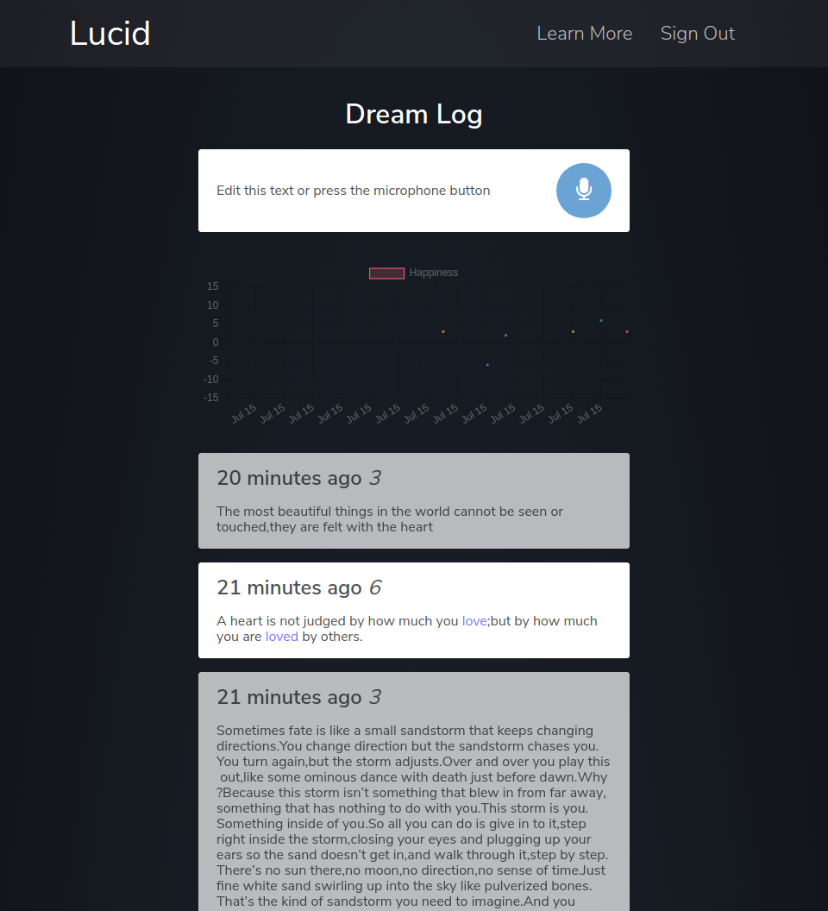

# Lucid
Online dream journal with sentiment analysis. Built at HackHarvard 2017





# Running Lucid

## 1. [Install MongoDB](https://docs.mongodb.com/v3.2/administration/install-community/)

### Start the mongo server
`sudo service mongod start`

### Create a db called lucid
```
mongo
> use lucid
> db.users.insert({})
```

## 2. Start the API
```
cd api
npm install
npm start
```

## 3. Start the application (separate thread)
```
cd app
npm install
npm start
```

The application will run on `localhost:3000`
